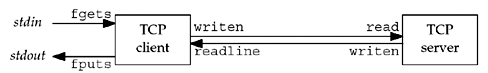

this is our simple C/S model




this is actually a full-duplex TCP connection


the server is concurrent, it can handle multi clients at the same time, which is implementing by forking child process


```c
for (;;) {
    clie_len = sizeof(cli_addr);
    conn_fd = Accept(listen_fd, (SA*)&cli_addr, &clie_len);

    if (0 == (child_pid = Fork())) {
        Close(listen_fd);
        str_echo(conn_fd);
        exit(0);
    }
    Close(conn_fd);
}
```

when fork is called, all file descriptor in parent process is copied to child process, like dup2, so it doesn't matter if parent close `conn_fd` or not, because `conn_fd` in child process still points to the right socket

and different process can use the same file descriptor, check this:


they point to the same file eventually, but they have different file offset, so it won't bother if they use the same file descriptor to read and write


function `str_echo` is the main logic for client handling, it reads data sent from client and writes it back

```c
while ((n = read(sockfd, buf, MAXLINE)) > 0)
	Writen(sockfd, buf, n);
```

when client drops or closes the connection, `read` will return 0, which is the bytes read from `sockfd`, then the while loop is break, so child process is terminated
